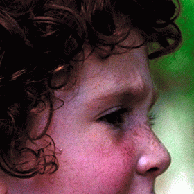
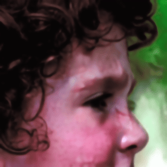
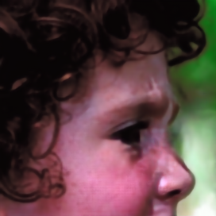
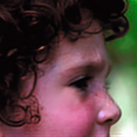
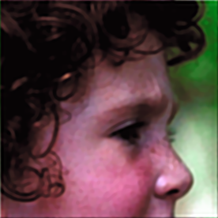

# Supplementary Material for IEEE ICIP 2024
Supplementary Material for IEEE ICIP 2024
**A Dictionary Based Approach For Removing Out-Of-Focus Blur**  
Authors: <samp>{aurangau, anil.kokaram}@tcd.ie</samp>

## Abstract
The field of image deblurring has seen tremendous progress with the rise of deep learning models. These models, albeit efficient, are computationally expensive and energy consuming. Dictionary based learning approaches have shown promising results in image denoising and Single Image Super-Resolution. We propose an extension of the Rapid and Accurate Image Super-Resolution (RAISR) algorithm introduced by Isidoro, Romano and Milanfar for the task of out-of-focus blur removal. We define an image quality index measure which aligns well with the perceptual quality of an image. A metric based blending strategy based on asset allocation strategies is also proposed. Our method demonstrates an average increase of approximately 13% (PSNR) and 10% (SSIM) compared to popular deblurring methods. Furthermore, our blending scheme curtails ringing artefacts post restoration.

## Filter Learning Algorithm

## Index J

## Results

|  |  |  |
| --- | --- | --- |
| Original Image | Blurry Image | Restormer |
|  |  |  |
| --- | --- | --- |
| IFAN | NBDNet | Landweber |

### Comparison of Moore-Penrose Pseudoinverse and Least Squares Solver

## Metric Q based blending strategy

## References

## Acknowledgments
