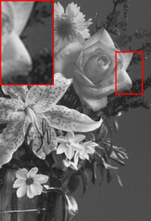

# Supplementary Material for IEEE ICIP 2024
Supplementary Material for IEEE ICIP 2024
**A Dictionary Based Approach For Removing Out-Of-Focus Blur**  
Authors: <samp>{aurangau, anil.kokaram}@tcd.ie</samp>

## Abstract
The field of image deblurring has seen tremendous progress with the rise of deep learning models. These models, albeit efficient, are computationally expensive and energy consuming. Dictionary based learning approaches have shown promising results in image denoising and Single Image Super-Resolution. We propose an extension of the Rapid and Accurate Image Super-Resolution (RAISR) algorithm introduced by Isidoro, Romano and Milanfar for the task of out-of-focus blur removal. We define an image quality index measure which aligns well with the perceptual quality of an image. A metric based blending strategy based on asset allocation strategies is also proposed. Our method demonstrates an average increase of approximately 13% (PSNR) and 10% (SSIM) compared to popular deblurring methods. Furthermore, our blending scheme curtails ringing artefacts post restoration.

## Filter Learning Algorithm

## Index J
|  |  |
| --- | --- |
| Original Image, J = 1.0 | Image Restored with a patch size of 13, J = 0.7031 |

|  |  |
| --- | --- |
| Blurry Image, J = 0.0 | Image Restored with a patch size of 21, J = 0.7796 |

## Results

### Tabular Results 
Set14[] and set5 were used to measure the performance of our algorithm against popular restoration techniques. 
#### Set14
| Algorithm | PSNR (dB) | SSIM |
| --- | --- | --- |
| IFAN | 23.100 | 0.653 | 
| Restormer | 24.566 | 0.723 | 
| NBDNet | 27.280 | 0.754 | 
| Landweber | 26.263 | 0.757 | 
| NA Landweber | 26.291 | 0.758 | 
| PC Landweber | 27.732 | 0.820 | 
| Ours | 29.287 | 0.847 | 

### Set 5
| Algorithm | PSNR (dB) | SSIM |
| --- | --- | --- |
| IFAN | 25.409 | 0.789 | 
| Restormer | 26.645 | 0.823 | 
| NBDNet | 31.036 | 0.869 | 
| Landweber | 29.011 | 0.849 | 
| NA Landweber | 30.019 | 0.867 | 
| PC Landweber | 30.715 | 0.890 | 
| Ours | 31.999 | 0.900 | 

### Visual Comparison 
|  |  |  |
| --- | --- | --- |
| Original Image | Blurry Image | Restormer |

|  |  |  |
| --- | --- | --- |
| IFAN | NBDNet | Landweber |

|  |  |  |
| --- | --- | --- |
| NA Landweber | PC Landweber | Ours |

### Average Blur
Size = 3 * 3
|  |  |   |
| --- | --- | --- |
| Original Image| Blurry Image | Restored Image |

### Comparison of Moore-Penrose Pseudoinverse and Least Squares Solver

|  |  |
| --- | --- |
| Original Image | Blurry Image |

|  |  |
| --- | --- |
| Image restored using Least Squares Approach | Image restored using Moore-Penrose Pseudoinverse Approach |

## Metric Q based blending strategy
|  |  |  |
| --- | --- | --- |
| Original Image | Image restored with P=13 | Averaging |

|  |  |  |
| --- | --- | --- |
| Iteration 1| Iteration 2 | Iteration 3 |

## References

## Acknowledgments
