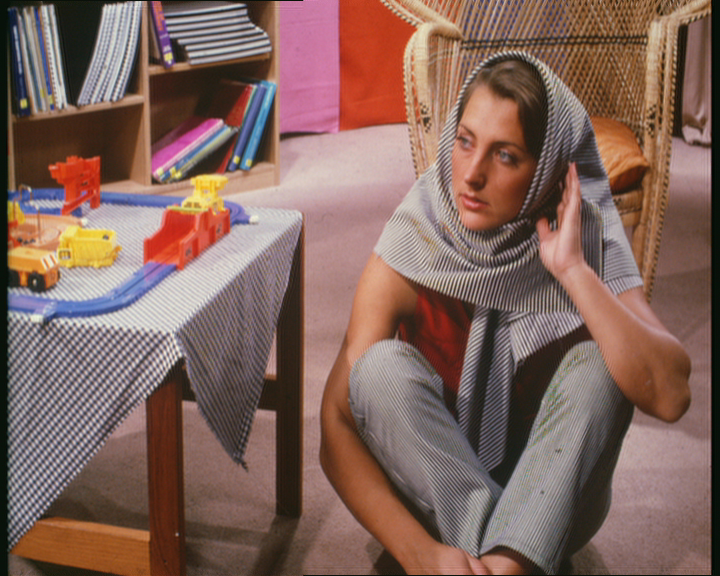
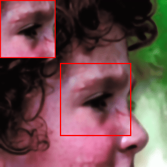
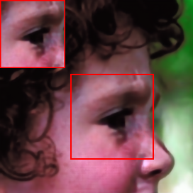
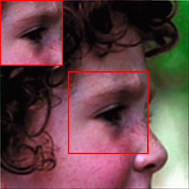
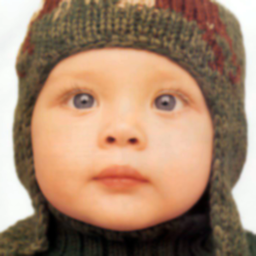
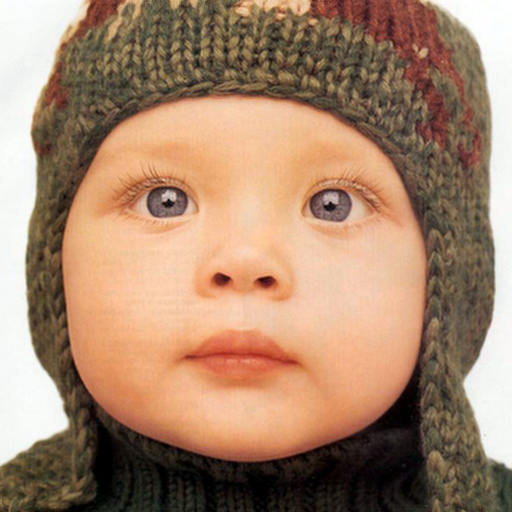
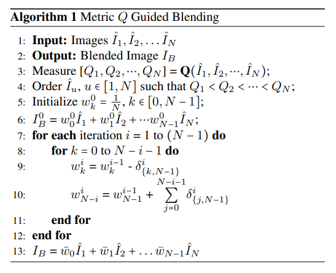
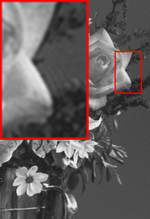
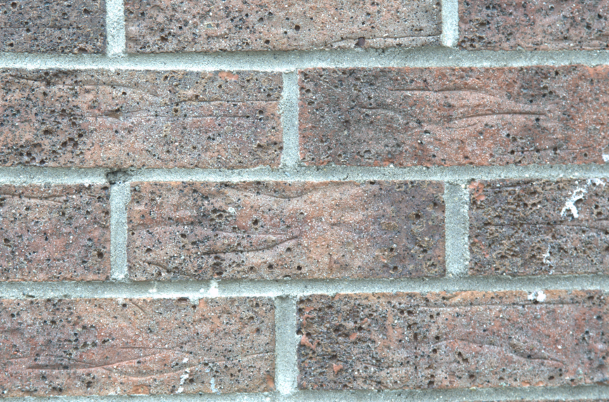
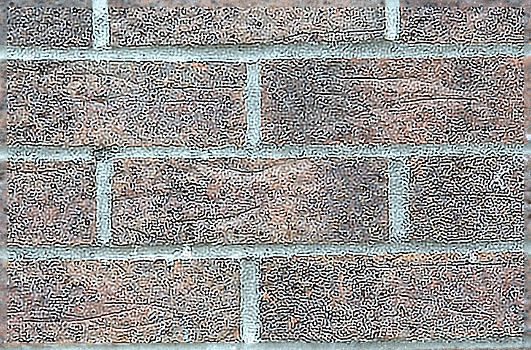

# Supplementary Material for IEEE ICIP 2024
Supplementary Material for IEEE ICIP 2024
**A Dictionary Based Approach For Removing Out-Of-Focus Blur**  
Authors: <samp>{aurangau, anil.kokaram}@tcd.ie</samp>

## Abstract
The field of image deblurring has seen tremendous progress with the rise of deep learning models. These models, albeit efficient, are computationally expensive and energy consuming. Dictionary based learning approaches have shown promising results in image denoising and Single Image Super-Resolution. We propose an extension of the Rapid and Accurate Image Super-Resolution (RAISR) algorithm introduced by Isidoro, Romano and Milanfar for the task of out-of-focus blur removal. We define an image quality index measure which aligns well with the perceptual quality of an image. A metric based blending strategy based on asset allocation strategies is also proposed. Our method demonstrates an average increase of approximately 13% (PSNR) and 10% (SSIM) compared to popular deblurring methods. Furthermore, our blending scheme curtails ringing artefacts post restoration.

## Filter Learning Algorithm
Flowchart 1 presents a detailed explanation of the learning technique adapted to the of deblurring.

## Index J
|  |  |
| --- | --- |
| Original Image, J = 1.0 | Image Restored with a patch size of 13, J = 0.7031 |

|  |  |
| --- | --- |
| Blurry Image, J = 0.0 | Image Restored with a patch size of 21, J = 0.7796 |

## Results

### Tabular Results 
Set14[1] and set5[2] were used to measure the performance of our algorithm against popular restoration techniques. 
#### Set14
| Algorithm | PSNR (dB) | SSIM |
| --- | --- | --- |
| IFAN [3] | 23.100 | 0.653 | 
| Restormer [4] | 24.566 | 0.723 | 
| NBDNet [5] | 27.280 | 0.754 | 
| Landweber [6] | 26.263 | 0.757 | 
| NA Landweber | 26.291 | 0.758 | 
| PC Landweber | 27.732 | 0.820 | 
| **Ours**| **29.287** | **0.847** |  

### Set 5
| Algorithm | PSNR (dB) | SSIM |
| --- | --- | --- |
| IFAN | 25.409 | 0.789 | 
| Restormer| 26.645 | 0.823 | 
| NBDNet| 31.036 | 0.869 | 
| Landweber | 29.011 | 0.849 | 
| NA Landweber | 30.019 | 0.867 | 
| PC Landweber | 30.715 | 0.890 |
| **Ours** | **31.999** | **0.900** | 

### Visual Comparison 
|  |  |  |
| --- | --- | --- |
| Original Image | Blurry Image | Restormer [4] |

|  |  |  |
| --- | --- | --- |
| IFAN [3] | NBDNet [5] | Landweber [6] |

|  |  |  |
| --- | --- | --- |
| NA Landweber | PC Landweber | Ours |

### Average Blur
Size = 3 * 3
|  |  |   |
| --- | --- | --- |
| Original Image| Blurry Image | Restored Image |

### Comparison of Moore-Penrose Pseudoinverse and Least Squares Solver
| Method Name | PSNR(Original, Restored) | PSNR(Original, Blurry) | PSNR Increase % |
| --- | --- | --- | --- |
| Moore-Penrose Pseudoinverse | 31.96 | 24.21 | 31.98 % | 
| Least-Squares Solver | 29.50 | 24.21 | 21.82 % | 
| **Overall Increase** | **8.34 %** | - | - | 

| Method Name | SSIM(Original, Restored) | SSIM(Original, Blurry) | SSIM Increase % |
| --- | --- | --- | --- | 
| Moore-Penrose Pseudoinverse | 0.9509 | 0.7857 | 21.02 % |
| Least-Squares Solver | 0.9100 | 0.7857 | 15.82 % |
| **Overall Increase** | **4.49 %** | - | - | 

|  |  |
| --- | --- |
| Original Image | Blurry Image |

|  |  |
| --- | --- |
| Image restored using Least Squares Approach | Image restored using Moore-Penrose Pseudoinverse Approach |

## Metric Q based blending strategy
Algorithm 1 provides a detailed method for calculating the weighting coefficients $$w = \{w_0, w_1, \ldots, w_{\{N-1\}}\}$$ 

|  |  |  |
| --- | --- | --- |
| Original Image, Q = 5.3653 | Image restored with P=13, Q = 5.2749 | Iteration 1, Q = 5.2777 |

## Ringing and effect on Q

|  |  | 
| --- | --- |
|Original Image, Q = 4.430 | Image with Ringing, Q = 30.0348 | 

## References
[1] Roman Zeyde, Michael Elad, and Matan Protter, “On
single image scale-up using sparse-representations,” in
Curves and Surfaces: 7th International Conference, Avignon, France, June 24-30, 2010, Revised Selected Papers
7. Springer, 2012, pp. 711–730.

[2] Marco Bevilacqua, Aline Roumy, Christine Guillemot,
and Marie Line Alberi-Morel, “Low-complexity singleimage super-resolution based on nonnegative neighbor
embedding,” 2012.

[3] Junyong Lee, Hyeongseok Son, Jaesung Rim, Sunghyun
Cho, and Seungyong Lee, “Iterative filter adaptive network for single image defocus deblurring,” in Proceedings of the IEEE/CVF Conference on Computer Vision
and Pattern Recognition, 2021, pp. 2034–2042.

[4] Syed Waqas Zamir, Aditya Arora, Salman Khan, Munawar Hayat, Fahad Shahbaz Khan, and Ming-Hsuan
Yang, “Restormer: Efficient transformer for highresolution image restoration,” in Proceedings of the
IEEE/CVF conference on computer vision and pattern
recognition, 2022, pp. 5728–5739.

[5] Liang Chen, Jiawei Zhang, Jinshan Pan, Songnan Lin,
Faming Fang, and Jimmy S Ren, “Learning a non-blind
deblurring network for night blurry images,” in Proceedings of the IEEE/CVF Conference on Computer Vision
and Pattern Recognition, 2021.

[6] Lizhong Wang, Pierre-Alain Fayolle, and Alexander G
Belyaev, “Reverse image filtering with clean and noisy
filters,” Signal, Image and Video Processing, vol. 17, no.
2, pp. 333–341, 2023.
## Acknowledgments
